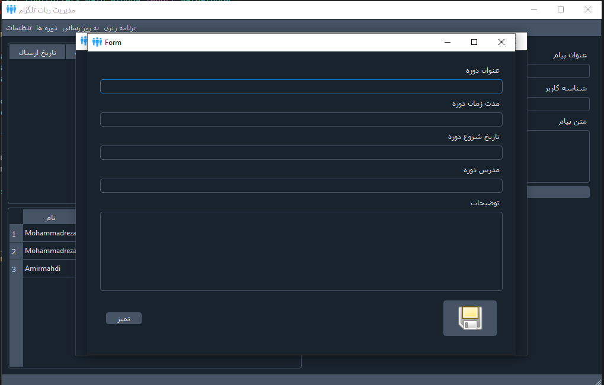
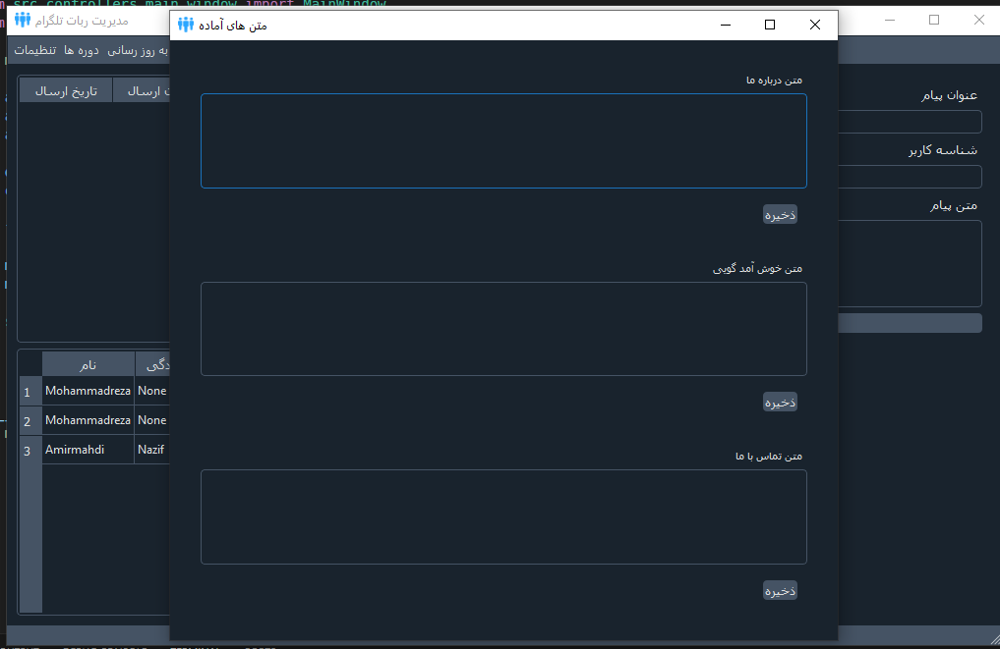

## School Telegram Bot
A Desktop Based Bot Manager Project That Provide A Ui To Use Easly and Manage Your Bot From Desktop Based Program

## What Can I Do With This Project ?
1. Manage List Of Cources and Send Theme To Each User That Requested
2. Can Easly Switch Between Bots By Just Providing Bot Key
3. Can Send Custom Massage To Specific User
4. Can Send Many Messages To Specific Users Or All Of Your Users In Current Time
5. Can Send Many Messages To Specific Users Or All Of Your Users In Specific Time That you Want
6. Can Send Picture With Caption
7. And Many Features That Will Come To This Project

## How Can I Run It ?
1. Like Other Python Project Its Simple to Run You Just Need At the First Create New Virtual Environment and Active It , Then Installing Requirements Packages By ``` pip install -r requirements.txt ``` 
Command
2. After Installing Requirements Packages You Just have One Step That Run ``` python main.py ``` Command
3. Program Will Run

## Some Preview Picture Of Program






## Contributing
I Will Happy If You Want to Contribute This Project and Develope it , Send Me Pr , I Will Check It Soon

## Hope To Enjoy
